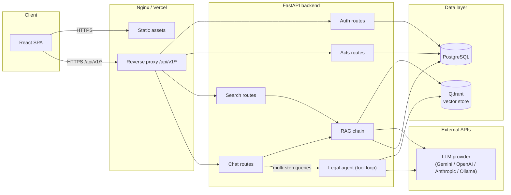

# Architecture

LegalSense AI is a Retrieval-Augmented Generation (RAG) system for querying Indian
Central Acts. This document describes the system's components, how data flows
through them, and the reasoning behind the major design decisions.

## Contents

- [System overview](#system-overview)
- [Directory structure](#directory-structure)
- [Request flow](#request-flow)
- [Backend architecture](#backend-architecture)
- [Frontend architecture](#frontend-architecture)
- [Data model](#data-model)
- [The RAG pipeline](#the-rag-pipeline)
- [Provider-agnostic LLM layer](#provider-agnostic-llm-layer)
- [Security architecture](#security-architecture)
- [Infrastructure](#infrastructure)
- [Design decisions and trade-offs](#design-decisions-and-trade-offs)

---

## System overview



**One-line summary**: the browser talks only to Nginx (or Vercel + Render in the
cloud deploy); Nginx serves the compiled React bundle and reverse-proxies
`/api/v1/*` to FastAPI; FastAPI's service layer talks to Postgres for
relational data and to the RAG chain for anything requiring semantic search or
an LLM call; the RAG chain retrieves candidate text from Qdrant and sends it,
plus the user's question, to whichever LLM provider is configured.

---

## Directory structure

```
Legalsense-AI/
├── backend/
│   ├── main.py                  # FastAPI app factory: CORS, middleware, routers, lifespan
│   ├── api/                     # HTTP layer — one router module per resource
│   │   ├── auth.py              #   /api/v1/auth/*   registration, login, refresh, profile
│   │   ├── acts.py              #   /api/v1/acts/*   browse Acts and Sections
│   │   ├── search.py            #   /api/v1/search   semantic search + history
│   │   ├── chat.py              #   /api/v1/chat/*   conversational RAG
│   │   ├── health.py            #   /health          liveness + readiness probes
│   │   ├── deps.py              #   shared FastAPI dependencies (auth, db session)
│   │   └── middleware.py        #   request-tracing middleware
│   ├── core/                    # Cross-cutting concerns
│   │   ├── config.py            #   Settings (pydantic-settings, env-driven)
│   │   ├── database.py          #   async SQLAlchemy engine/session factory
│   │   ├── models.py            #   ORM models (User, Conversation, Message, ...)
│   │   ├── security.py          #   JWT issuing/verification, password hashing
│   │   └── logging_config.py    #   structlog setup
│   ├── schemas/                 # Pydantic request/response contracts, one file per resource
│   ├── services/                # Business logic — routers call these, never the ORM directly
│   │   ├── user_service.py
│   │   ├── act_service.py
│   │   ├── search_service.py
│   │   └── chat_service.py
│   ├── chains/                  # RAG internals
│   │   ├── embedding.py         #   chunking, Gemini embeddings, Qdrant collection mgmt
│   │   ├── retriever.py         #   HybridRetriever: dense search + payload filters
│   │   ├── llm.py               #   provider-agnostic LLM abstraction
│   │   ├── prompts.py           #   system prompt, RAG prompt templates
│   │   └── rag.py               #   RAGChain orchestrator (retrieve → prompt → generate)
│   └── agents/
│       └── legal_agent.py       #   multi-tool agent (search/lookup/compare) with a bounded loop
├── frontend/
│   ├── src/
│   │   ├── pages/                # One component per route (Login, Chat, Search, Acts, Dashboard)
│   │   ├── components/           # Shared UI (Layout, Button, Modal)
│   │   ├── hooks/                # useAuth (JWT session context)
│   │   ├── api/client.ts         # Typed HTTP client, token refresh handling
│   │   └── types/                # Shared TypeScript types mirroring backend schemas
│   └── vercel.json               # SPA rewrite rule for Vercel deploys
├── scripts/
│   ├── ingest/parse_act.py       # PDF → structured JSON parser (PyMuPDF)
│   └── seed_db.py                # Idempotent DB + vector store seeder
├── data/processed/               # 14 pre-parsed Act JSON files (checked in)
├── docker/                       # Dockerfile.backend, Dockerfile.frontend, nginx.conf
├── docker-compose.yml            # Full local stack: Postgres + Qdrant + backend + frontend
├── render.yaml                   # Render Blueprint for the backend (cloud deploy)
├── .github/workflows/ci.yml      # Lint + test on every push/PR
├── pyproject.toml                # ruff configuration
├── requirements.txt              # Runtime Python dependencies
├── requirements-dev.txt          # + test/lint tooling
└── tests/                        # pytest suite (unit + API integration tests)
```

---

## Request flow

A typical authenticated request:

1. Browser sends `Authorization: Bearer <access_token>` with the request.
2. Nginx (or Vercel's rewrite rule in the cloud deploy) forwards `/api/v1/*` to
   the FastAPI backend.
3. `RequestTracingMiddleware` (`backend/api/middleware.py`) attaches a request
   ID for structured logging.
4. `slowapi`'s rate limiter checks the request against the configured limit
   (60/min default, 10/min on `/auth/*`).
5. The route's `Depends(get_current_user)` dependency decodes the JWT,
   loads the `User` row, and rejects the request with `401` if the token is
   invalid, expired, or the user is deactivated.
6. The router delegates to a **service** (`backend/services/*.py`) — routers
   never touch the ORM or Qdrant directly. This keeps HTTP concerns (status
   codes, schema validation) separate from business logic, and is what makes
   the services independently unit-testable.
7. The service returns a Pydantic response model, which FastAPI serializes.
8. A global exception handler in `main.py` catches unhandled exceptions and
   returns a generic `500` — internal error details are logged, not leaked
   to the client.

---

## Backend architecture

**Layering**: `api/` (HTTP) → `services/` (business logic) → `core/models.py`
(ORM) + `chains/` (RAG). Each router module owns one resource; each service
class owns the logic for that resource, including authorization checks (e.g.
`ChatService` scopes every conversation query by `user_id`, which is what
prevents one user from reading another user's conversations by guessing a
UUID).

**Async throughout**: the backend is `async`/`await` end-to-end — FastAPI's
async route handlers, SQLAlchemy 2.0's async engine (`asyncpg` driver), and
async HTTP clients for the LLM SDKs. Qdrant's Python client is synchronous;
its calls run inside the async request but are fast enough locally that this
hasn't required offloading to a thread pool (worth revisiting if Qdrant is
ever hosted with higher latency than the same-region default).

**Configuration**: all runtime configuration lives in `backend/core/config.py`
as a single `pydantic-settings` `Settings` class, loaded once via
`@lru_cache`. Every field is overridable by an environment variable of the
same name — there are no hardcoded hostnames, ports, or credentials in
application code. See [`configuration.md`](configuration.md) for the full
reference.

---

## Frontend architecture

A Vite + React 19 + TypeScript single-page app, no server-side rendering.

- **Routing**: `react-router-dom` v7, with a `PrivateRoute` wrapper in `App.tsx`
  that redirects unauthenticated users to `/login`.
- **State**: local component state (`useState`/`useEffect`) plus one context
  provider (`useAuth`) for the JWT session. No global state library — the app
  is small enough that prop drilling and per-page fetches are simpler than the
  overhead of Redux/Zustand/etc.
- **Styling**: a single design-token system in `src/index.css` (CSS custom
  properties for color, spacing, radius, typography) consumed by per-page
  CSS files. No CSS-in-JS, no utility-class framework.
- **API client**: `src/api/client.ts` wraps `fetch`, attaches the bearer
  token, and transparently retries a request once after refreshing the
  access token on a `401`.
- **Type safety**: `strict: true` in `tsconfig.app.json` — every prop, state
  variable, and API response is fully typed against `src/types/index.ts`,
  which mirrors the backend's Pydantic schemas by hand (there is no
  code-generation step from the OpenAPI schema; keep the two in sync
  manually when either side changes).

---

## Data model

Six tables in PostgreSQL. Full column-level reference in
[`database.md`](database.md); summary here:

| Table | Purpose | Owned by |
|---|---|---|
| `users` | Accounts, hashed passwords, role | `user_service.py` |
| `conversations` | One row per chat thread | `chat_service.py` |
| `messages` | User + assistant turns within a conversation | `chat_service.py` |
| `search_history` | Log of past semantic searches per user | `search_service.py` |
| `act_metadata` | One row per ingested Act (title, slug, year) | `act_service.py` |
| `sections` | One row per Section of an Act (full text lives here) | `act_service.py` |

The **vector store** (Qdrant) is a parallel index over `sections` content: each
chunk of section text is embedded and stored as a Qdrant point with payload
metadata (`act_slug`, `section_number`, `chapter`) mirroring the relational
data, so retrieval results can be filtered without a join back to Postgres.

---

## The RAG pipeline

Covered in depth in [`rag-pipeline.md`](rag-pipeline.md). Short version:

```
Ingestion (offline, scripts/seed_db.py):
  Act PDF → parse_act.py → structured JSON → chunk_section() (1000 words,
  200-word overlap) → Gemini text-embedding-004 → Qdrant upsert

Query time (backend/chains/rag.py):
  user question → embed_query() → Qdrant hybrid search (dense + payload
  filters) → dedupe by section → truncate to token budget → build prompt
  with SYSTEM_PROMPT + retrieved context → LLM.generate() → extract
  [Section X, Act Name] citations from the response → return
```

The **agent** (`backend/agents/legal_agent.py`) is a separate, more capable
path used when a question needs multi-step reasoning (e.g. comparing two
Acts): the LLM is given three tools (`search_sections`, `lookup_section`,
`compare_sections`) and runs a bounded loop (`MAX_ITERATIONS = 3`) of
tool-call → execute → feed result back, before being forced to produce a
final answer. Tool results are wrapped in explicit delimiters and labeled as
untrusted data in the prompt, since they contain retrieved document text that
could otherwise be used for prompt injection.

---

## Provider-agnostic LLM layer

`backend/chains/llm.py` defines an abstract `LLMProvider` with three methods
(`generate`, `stream`, `generate_with_tools`) and five concrete
implementations: `GeminiProvider`, `OpenAIProvider`, `AnthropicProvider`,
`OllamaProvider`, and Azure OpenAI (which reuses `OpenAIProvider` with a
different base URL). `create_llm_provider()` is a factory that reads
`LLM_PROVIDER` from settings and instantiates the right class, caching the
result as a module-level singleton.

Switching providers is a single environment variable change
(`LLM_PROVIDER=openai`, plus the matching API key) — no code changes, no
redeploy of a different image. This is what makes the free-tier deploy path
practical: start on Gemini's free API tier, move to a paid provider later
without touching the RAG chain, the agent, or any router.

---

## Security architecture

- **Authentication**: stateless JWTs (`HS256`), a 30-minute access token and
  a 7-day refresh token. Passwords are hashed with `bcrypt` via `passlib`.
- **Authorization**: every mutating and sensitive route requires
  `Depends(get_current_user)`; resource ownership is enforced at the service
  layer (queries filter by `user_id`, not just by resource ID) — this is
  what prevents IDOR (one user reading/deleting another user's data).
- **Input validation**: every request body is a Pydantic model with explicit
  length/range bounds (`Field(..., max_length=...)`, `Query(..., le=...)`),
  which both documents the API and rejects oversized payloads before they
  reach business logic.
- **SQL injection**: not reachable — all queries go through SQLAlchemy's
  ORM/Core query builder with bound parameters, never raw string
  interpolation.
- **Prompt injection**: retrieved document text and agent tool results are
  explicitly delimited (`<<<BEGIN_TOOL_RESULT>>>` / `<<<END_TOOL_RESULT>>>`)
  and labeled as untrusted, non-instructional data in the prompts that
  include them, with an explicit system-prompt instruction not to follow
  directives found in that text.
- **Rate limiting**: `slowapi`, keyed by remote address — 60/min globally,
  10/min on `/auth/*` to slow down credential-stuffing attempts.
- **Secrets**: no default secrets ship in the repo. `docker-compose.yml` uses
  the `${VAR:?message}` syntax so the stack refuses to start without real
  values for `JWT_SECRET_KEY`, `POSTGRES_PASSWORD`, and `GEMINI_API_KEY`.
- **Known, deliberately deferred gap**: JWT access and refresh tokens are
  stored in the browser's `localStorage`, which is readable by any script
  running on the page (XSS-stealable). Moving to httpOnly cookies would
  require CSRF protection and changes to the login flow and CORS
  configuration on both frontend and backend — tracked as a future change,
  not done silently.

---

## Infrastructure

Two supported deployment shapes (full walkthroughs in
[`deployment-process.md`](deployment-process.md)):

1. **Docker Compose** — Postgres, Qdrant, the FastAPI backend, and an
   Nginx container serving the built React app, all on one host. Best for
   local development, self-hosting, or a VPS.
2. **Split cloud deploy** — Vercel (frontend, static + edge), Render
   (backend, Docker-based web service), Neon (managed Postgres), Qdrant
   Cloud (managed vector store). Every component has a free tier; this is
   the path documented as the default "deploy for free" option.

Both shapes run the *same application code* — the backend's configuration is
entirely environment-variable-driven, so nothing in `backend/` or
`frontend/` needs to know which infrastructure it's running on.

---

## Design decisions and trade-offs

A few choices that aren't obvious from reading the code in isolation:

- **Gemini for embeddings, not a local model.** The README originally
  described local `sentence-transformers` embeddings; the actual
  implementation calls Gemini's `text-embedding-004` API. This avoids
  bundling a ~90MB model and PyTorch into the backend image and needing a
  GPU for reasonable throughput, at the cost of an external API dependency
  and per-embedding cost during ingestion. Since ingestion is a one-time,
  offline step (`scripts/seed_db.py`), this trade-off favors deploy
  simplicity over runtime independence.
- **Services own authorization, not a shared decorator.** Ownership checks
  (`.where(Conversation.user_id == user_id)`) are written explicitly in each
  service method rather than factored into a generic "check ownership"
  decorator. This is more repetitive but means each query's authorization
  logic is visible at the point where the query runs, rather than requiring
  a reader to trace through a decorator to understand what's actually
  enforced.
- **No ORM-level soft deletes.** Deleting a conversation
  (`ChatService.delete_conversation`) is a real `DELETE`, cascading to its
  messages. There's no "trash" or undo — acceptable for a chat history
  feature, would need revisiting for anything with compliance/audit
  requirements.
- **The agent and the plain RAG chain are separate code paths.** `RAGChain`
  (single retrieve-then-generate call) and `LegalAgent` (multi-step
  tool-calling loop) both exist rather than unifying into one
  always-agentic path. The plain chain is cheaper (one LLM call) and
  sufficient for most single-fact questions; the agent is reserved for
  cases that need it. `ChatService` currently always uses `RAGChain` — the
  agent is available as a separate code path but not yet wired into the
  chat endpoint's default flow.
