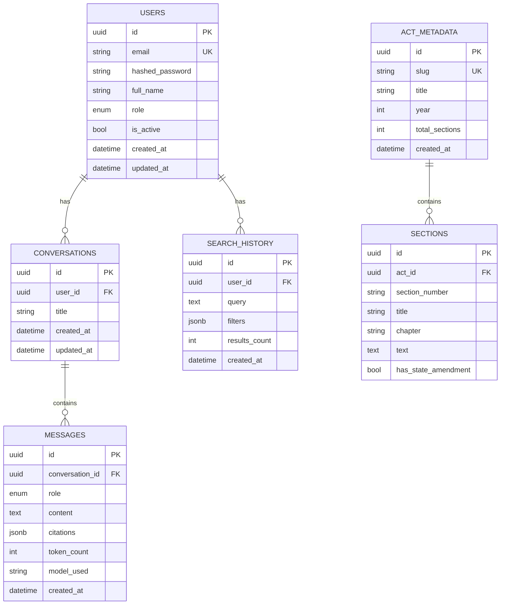

# Database Schema

PostgreSQL via async SQLAlchemy 2.0 (`asyncpg` driver). All models are
defined in `backend/core/models.py`. All primary keys are UUIDv4, generated
client-side (`uuid.uuid4()`) rather than by the database.

## Entity relationship overview



`ACT_METADATA`/`SECTIONS` are not linked to `USERS` — Acts are shared,
read-only reference data seeded once via `scripts/seed_db.py`, not
per-user content.

---

## Table reference

### `users`

| Column | Type | Constraints | Notes |
|---|---|---|---|
| `id` | UUID | PK | |
| `email` | String(320) | unique, not null, indexed | |
| `hashed_password` | String(128) | not null | bcrypt hash via `passlib` |
| `full_name` | String(256) | not null | |
| `role` | Enum(`user`, `admin`) | not null, default `user` | `require_admin` dependency checks this, but no route currently uses it |
| `is_active` | Boolean | not null, default `true` | Deactivated users fail auth (`get_current_user` checks this) |
| `created_at` / `updated_at` | timestamptz | server-managed | `updated_at` auto-updates via `onupdate=func.now()` |

**Relationships**: `conversations` (cascade delete), `search_history` (cascade delete).

### `conversations`

| Column | Type | Constraints | Notes |
|---|---|---|---|
| `id` | UUID | PK | |
| `user_id` | UUID | FK → `users.id` `ON DELETE CASCADE`, indexed | Every query in `ChatService` filters by this — it's the IDOR boundary |
| `title` | String(512) | default `"New Conversation"` | Auto-generated from the first message via `RAGChain.generate_title()`, falls back to a 60-char truncation of the message if title generation fails |
| `created_at` / `updated_at` | timestamptz | server-managed | |

**Relationships**: `messages` (cascade delete, ordered by `created_at`).

### `messages`

| Column | Type | Constraints | Notes |
|---|---|---|---|
| `id` | UUID | PK | |
| `conversation_id` | UUID | FK → `conversations.id` `ON DELETE CASCADE`, indexed | |
| `role` | Enum(`user`, `assistant`, `system`) | not null | |
| `content` | Text | not null | |
| `citations` | JSON/JSONB | nullable | JSONB on Postgres, plain JSON on SQLite (test suite) — see `JSON_TYPE` in `models.py` |
| `token_count` | Integer | default `0` | From the LLM response's usage metadata |
| `model_used` | String(128) | nullable | e.g. `gemini-2.0-flash` |
| `created_at` | timestamptz | server-managed | |

### `search_history`

| Column | Type | Constraints | Notes |
|---|---|---|---|
| `id` | UUID | PK | |
| `user_id` | UUID | FK → `users.id` `ON DELETE CASCADE`, indexed | |
| `query` | Text | not null | |
| `filters` | JSON/JSONB | nullable | Currently only ever `{"act_filter": "..."}` or `null` |
| `results_count` | Integer | default `0` | |
| `created_at` | timestamptz | server-managed | |

### `act_metadata`

| Column | Type | Constraints | Notes |
|---|---|---|---|
| `id` | UUID | PK | |
| `slug` | String(256) | unique, not null, indexed | e.g. `the_indian_contract_act_1872`, derived from the Act title by `_slug()` in `embedding.py` |
| `title` | String(512) | not null | |
| `year` | Integer | nullable | |
| `total_sections` | Integer | default `0` | |
| `created_at` | timestamptz | server-managed | |

**Relationships**: `sections` (cascade delete).

### `sections`

| Column | Type | Constraints | Notes |
|---|---|---|---|
| `id` | UUID | PK | |
| `act_id` | UUID | FK → `act_metadata.id` `ON DELETE CASCADE`, indexed | |
| `section_number` | String(16) | not null | |
| `title` | String(512) | not null | |
| `chapter` | String(256) | nullable | |
| `text` | Text | not null | Full statutory text of the section |
| `has_state_amendment` | Boolean | not null, default `false` | Surfaces a UI alert in the Acts browser |

**Indexes**: composite index on `(act_id, section_number)`.

---

## Vector store (Qdrant) — not a relational table, but part of the data model

The `sections.text` column is mirrored into Qdrant as chunked, embedded
points. One Qdrant point per chunk (a section may span multiple points if it
exceeds `RAG_CHUNK_SIZE`), with this payload:

```json
{
  "act_title": "...",
  "act_slug": "...",
  "section_number": "...",
  "section_title": "...",
  "chapter": "...",
  "has_state_amendment": false,
  "text": "...",
  "chunk_index": 0
}
```

Point IDs are deterministic: an MD5 hash of
`{act_slug}:{section_number}:{chunk_index}`, so re-running
`scripts/seed_db.py` upserts (overwrites) rather than duplicates existing
points.

---

## Migrations

**Alembic is a listed dependency (`alembic==1.15.2` in `requirements.txt`)
but is not currently configured** — there is no `alembic.ini` and no
migrations directory in this repo. Schema creation is handled entirely by
`init_db()` in `backend/core/database.py`, which calls
`Base.metadata.create_all()` on every application startup (and again,
redundantly, inside `scripts/seed_db.py`).

**What this means in practice**:
- `create_all()` only creates tables/columns that don't exist yet — it does
  not alter existing tables. Adding a new column to a model will **not**
  retroactively add it to an already-provisioned database; you'd need to
  run the `ALTER TABLE` by hand or set up real Alembic migrations.
- There is no migration history, so there's no way to roll back a schema
  change or track what changed when.
- For a single-environment hobby/demo deployment this is fine. Before
  running this in a setting where the schema will evolve after initial
  launch, run `alembic init` and generate a baseline migration from the
  current models — don't rely on `create_all()` past the first deploy.
